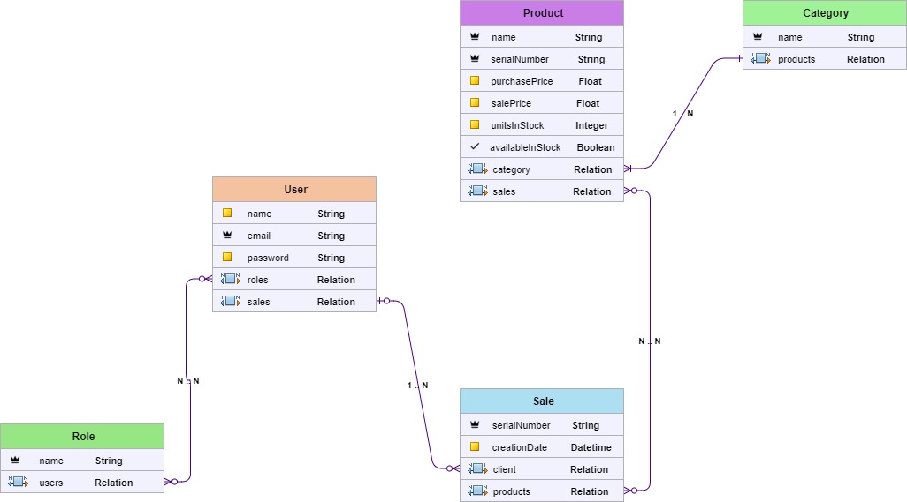
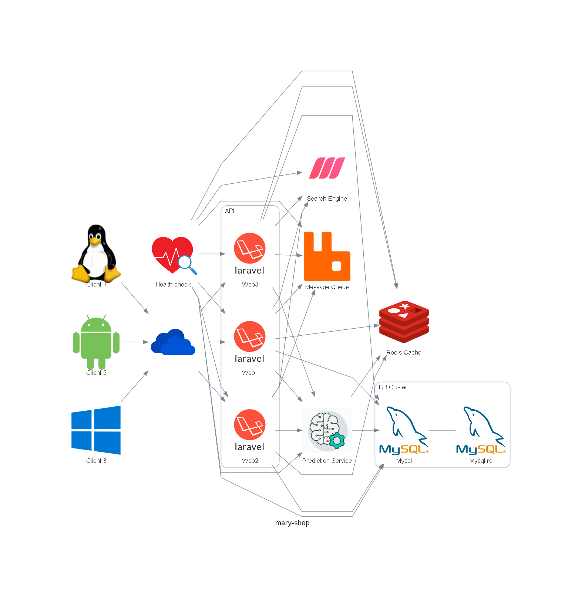

# mary-shop
A simple e-commerce project exercise implemented in laravel. 
Using some Clean Architecture principles.

### Data model


### Project architecture

* Independent of database engine
* Level 2 of Richardson Maturity Model
* Use JWT
* Use [Meilisearch](https://www.meilisearch.com/docs) as search engine
* Use [Redis](https://redis.io/) as cache
* Use [Rabbitmq](https://www.rabbitmq.com/) as message queue

#### Routes

| Method    | Path                        | Role Required    | Description                                         |
| --------- | --------------------------- | ---------------- | --------------------------------------------------- |
| POST	     | /api/login	| Anonymous	 | Auth                                                |
| POST	     | /api/register              	| Anonymous      	 | Allow user register                                 |
| POST	     | /api/product/create	| Admin	 | Create a new product                                |
| GET	     | /api/product/list	| Anonymous	 | List all product with stock                         |
| POST	     | /api/sale/create	| User	 | Allow user buy products                             |
| GET	     | /api/sale/report	| Admin	 | Get Sales report                                    |
| GET	     | /telescope	| Anonymous	 | Developer debug assistant for the Laravel framework |


### System design


### Run project
* [PHP with Laravel 10.10](laravel-backend/README.md)


### Run integration tests
```
cd nodejs-integration-tests
yarn
yarn start
```

### Todo

* paginate product list
* finish the OpenAPI v3 specification 
* implement a prediction server
* implement a recomendation engine
* implement a OLAP engine
* implement a health check API